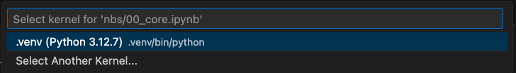

# 🐍 Python project template


<!-- WARNING: THIS FILE WAS AUTOGENERATED! DO NOT EDIT! -->

## 📝 Developer Guide

This project uses `nbdev` alongisde other standard python tooling. The
main tool for project management is [`uv`](https://docs.astral.sh/uv/).

### 🧩 Settings and project configuration

Most of the project settings, including dependencies, versioning, and
*most* tooling configuration are located in the `pyproject.toml` file.
You can read more about the format of this file in [the official Python
Packaging User
Guide](https://packaging.python.org/en/latest/guides/writing-pyproject-toml/).

Settings that are specific for `nbdev` **only** are contained in the
`settings.ini` file.

### 🛠️ Project tooling

We use the following tools during development:

- [`uv`](https://docs.astral.sh/uv/) for managing the project,
  dependencies, and virtual environment (including `python`).
- [`ruff`](https://docs.astral.sh/ruff/) for source files linting and
  formatting.
- [`nbdev`](https://nbdev.fast.ai/) for literate programming and simple
  tests.
- [`pytest`](https://docs.pytest.org/) and
  [`coverage`](https://coverage.readthedocs.io/) for project wide
  testing.
- [`mypy`](https://www.mypy-lang.org/) for type checking.
- [`deptry`](https://deptry.com/) for dependency validation.
- [`nbQA`](https://nbqa.readthedocs.io/) for quality control on Jupyter
  notebooks.
- [`Poe`](https://poethepoet.natn.io/index.html) as a dev time task
  runner.

### 🚀 Installing `uv`

`uv` is a system-level tool, and must be installed **before** setting up
anything else. This process only needs to be done once per computer,
which will make `uv` available for all the repositories that use it.

#### 🐧 Linux and 🍎 macOS

To install `uv` in linux, run

``` sh
curl -LsSf https://astral.sh/uv/install.sh | sh
uv self update
```

in a terminal. This will install `uv` and make sure it is updated to the
latest version available

#### 🍎 Alternative in macOS

If using macOS, you can alternatively use the `brew` package manager
(this method should automatically install the latest version available):

``` sh
brew install uv
```

#### 🖥️ Other platforms and methods

Additional information concerning the installation of `uv` can be found
in [the official installation
guide](https://docs.astral.sh/uv/getting-started/installation/).

### 💾 Installing `python-template` in Development mode

1.  Clone the repository by running

    ``` sh
    git clone git@github.com:real-analytics-rd/python-template.git
    ```

2.  Go inside the folder containing the cloned repository, and run

    ``` sh
    uv sync  --all-extras
    ```

    This will create a [virtual
    environment](https://docs.python.org/3/library/venv.html#module-venv)
    that will contain `python` together with all the dependencies needed
    for the package. All the depencencies will be installed in the
    `.venv` folder

> ⚠️🚧 **IMPORTANT** 🚧⚠️  
> You want to make sure that your IDE is looking at the right `python`
> for this project, and not at the system level `python`. Most IDEs like
> VSCode or PyCharm should detect the virtual environment and use it
> automatically.

If the virtual environment is not automatically detected by your IDE,
run the “Select Python Interpreter” command:


And then make sure to select the `python` version located inside the
`.venv` folder:


For notebooks, make also sure you select the Kernel corresponding to the
`python` version in `.venv`:




### 🚜 Managing dependencies

- To add a dependency:

  ``` sh
  uv add some_dependency
  ```

- To add a development only dependency:

  ``` sh
  uv add --dev some_dev_dependency
  ```

- To remove a dependency:

  ``` sh
  uv remove some_dependency
  ```

- To update a dependency:

  ``` sh
  uv sync --upgrade-package some_dependency
  ```

- To upgrade ALL dependencies:

  ``` sh
  uv sync --upgrade
  ```

> 💡 Any time dependencies change, the file `uv.lock` will get
> automatically updated. Make sure you commit the changes to the
> `uv.lock` file to `git` as well!

Current project dependencies can be found in the `pyproject.toml` file,
under the `[project]` header. Dev dependencies are listed under the
`[tool.uv]` header.

It is possible to manually edit the dependencies and dev dependencies
directly in this file (for instance if one needs to change some version
constrains for a specific dependency). When doing so, you should always
run the command

``` sh
uv lock
```

to regenerate the lockfile, and

``` sh
uv sync
```

to make sure the dependencies are installed in the virtual environment.

> ⚠️ Dependecies should be managed **using `uv` only**, do not install
> depdencies using any other methods! In particular, do not use `conda`,
> `pip`, or `nbdev` requirements, as doing so will make the virtual
> environment inconsistent!

### ⚙️ Development tasks

Various development tasks (including common `nbdev` actions) have been
wrapped for convenience as `poe` tasks. The are listed under the
different `[tool.poe.tasks.*]` headers in the `pyproject.toml` file, or
can be shown in the terminal running

``` sh
uv run poe
```

    Poe the Poet - A task runner that works well with poetry.
    version 0.29.0

    Result: No task specified.

    Usage:
      poe [global options] task [task arguments]

    Global options:
      -h, --help            Show this help page and exit
      --version             Print the version and exit
      -v, --verbose         Increase command output (repeatable)
      -q, --quiet           Decrease command output (repeatable)
      -d, --dry-run         Print the task contents but don't actually run it
      -C PATH, --directory PATH
                            Specify where to find the pyproject.toml
      -e EXECUTOR, --executor EXECUTOR
                            Override the default task executor
      --ansi                Force enable ANSI output
      --no-ansi             Force disable ANSI output

    Configured tasks:
      check                 Run all the checks for file formatting, linting, typing, and dependency validation
      clean                 Remove temporary files generated during build process
      format                Reformat all notebooks and python files
      sync                  Full package synchronisation: runs notebook cleaning and formatting, exports library and readme files, regenerates lockfile and update virtual environment
      test                  Run testsuite, including both notebook tests and pytest

Each of these tasks can be run at any time from the terminal by calling

``` sh
uv run poe TASK_NAME
```

> 💡 If you find yourself using this very often, and don’t want to type
> so much, you can add an alias `alias uvp="uv run poe"` in your
> environment config file, and after that you can use `uvp TASK_NAME`
> instead of `uv run poe TASK_NAME`.

## Usage

## How to use

Fill me in please! Don’t forget code examples:
